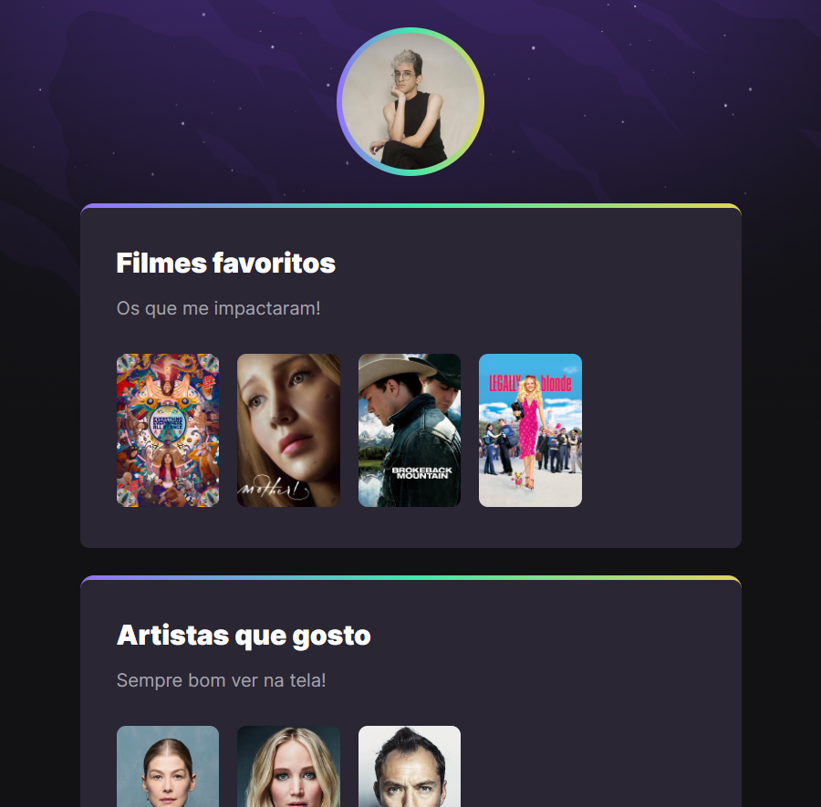

# FaveCine - NLW | Rocketseat

Projeto construído junto ao evento Next Level Week da Rocketseat.

## Screenshot

## Link para acesso

[Clique aqui!](https://enzozaqueu.github.io/favecine/)

## Tecnologias

- HTML
- CSS
- Git e GitHub

## O que aprendi

A partir do das aulas mudei de editor de código, de Atom para VS Code, e com isso aprendi a configurar o Git após um pouco de confusão.
Mas muito mais importante foi a introdução à animação, que ainda não havia interagido mas tinha curiosidade.

## Recursos úteis

- [devdocs](https://devdocs.io/css/css_values_and_units) - Documentação diversa.

## Contato
[Linkedin](https://www.linkedin.com/in/enzo-zaqueu-780378149/)

enzo.zaqueu@gmail.com
